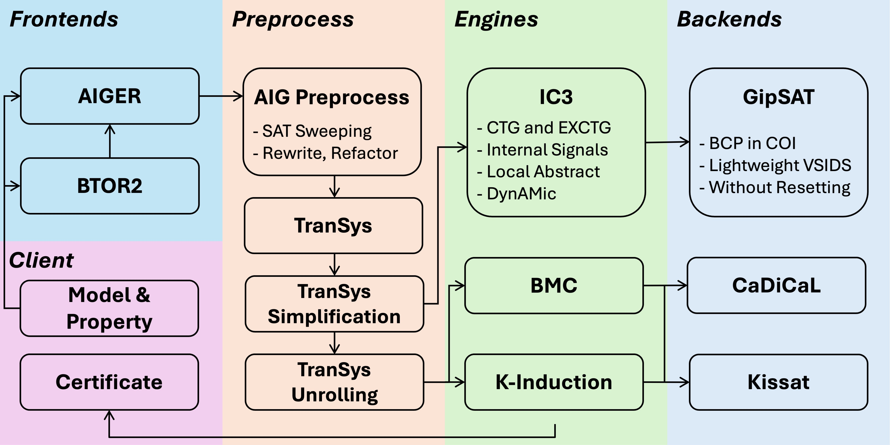

# rIC3 Hardware Model Checker

[](https://www.gnu.org/licenses/gpl-3.0)
[](https://github.com/gipsyh/rIC3/actions/workflows/build.yml)
[](https://crates.io/crates/rIC3)
[](https://hub.docker.com/r/gipsyh/ric3)

### HWMCC
rIC3 achieved first place in both the bit-level track and the word-level bit-vector track at the 2024 Hardware Model Checking Competition ([HWMCC'24](https://hwmcc.github.io/2024/)).

<p align="center">
	
	
</p>

To view the submission for HWMCC'24, please checkout the `HWMCC24` branch or download the binary release at https://github.com/gipsyh/rIC3-HWMCC24.

### rIC3 Tool Flow


### Install From Crates.io
```cargo install rIC3```

### Install From Source
- Install the Rust compiler https://www.rust-lang.org/
- Switch to nightly ```rustup default nightly```
- ```git clone --recurse-submodules https://github.com/gipsyh/rIC3```
- Build ```cd rIC3 && cargo b --release```
- Run ```cargo r --release -- <AIGER FILE>```
- Install ```cargo install --path .```

### Run
- 16-threads Portfolio ```rIC3 <AIGER FILE>```
- single-thread IC3 ```rIC3 -e ic3 <AIGER FILE>```

### Docker
- build image: ```docker build -t ric3 .```
- run: ```docker run -v <AIGER FILE>:/model.aig ric3 model.aig```

Copyright (C) 2023 - Present, Yuheng Su (gipsyh.icu@gmail.com). All rights reserved.

Without obtaining authorization, rIC3 is not allowed to be used for any commercial purposes.
