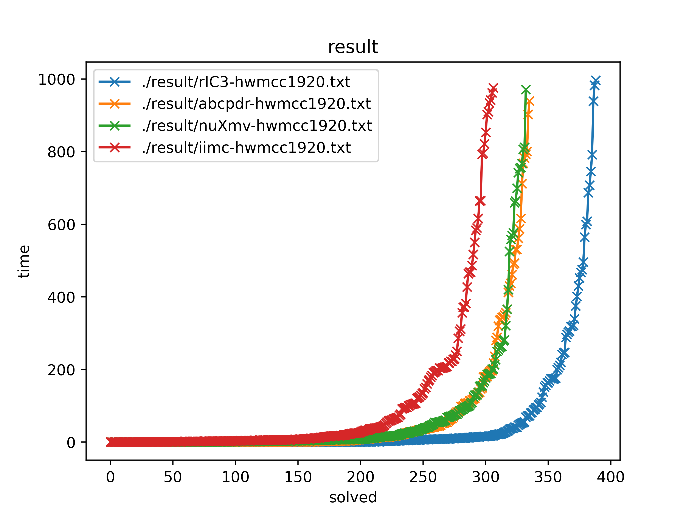

# rIC3

IC3 algorithm implemented in rust.

rIC3 demonstrates competitive performance and scalability compared to state-of-the-art implementations.

<p align="center">
	</img>
</p>

## Usage
```
cargo r --release -- <aag file>
```
For FM2024 artifact, `git checkout fm24`